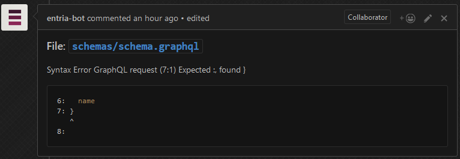
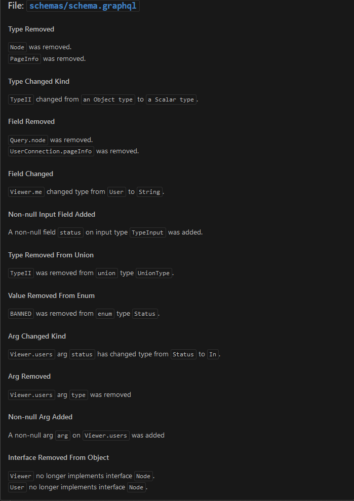

# GraphQLVigilantBot

## Installation
First clone this repository, then check `.env.example` for which environment variables
 you need to set before running this bot.
We recommend you to create a new GitHub account for your bot, which is going to be
  used to author the comments.

Now run
```bash
npm install
npm start
```

### Using Docker
A Dockerfile is also provided, you can use it to run the bot:

```bash
docker build -t graphql-vigilant-bot .
docker run --env-file ./.env -p 7010:7010 graphql-vigilant-bot
```

#### docker-compose

`docker-compose up`

The bot will be available at http://localhost.

Or you can deploy directly to Heroku:
[](https://heroku.com/deploy)

## Setup

You need to add a webhook pointing to this bot, use `application/json` as 
 the `Content Type`, and select the `Pull request` event.

## Development

Since this bot depends on Github webhooks, we gonna need to use [ngrok]()
 to redirect the webhook request to our machine.

Run:
```bash
./ngrok http $PORT
```

Where `$PORT` is the port you are going to run the bot.

Grab the `*.ngrok.io` URL and add it as webhook on your repo.

### How it looks like

 > Syntax Errors
 >
 > 
 
 > Breaking Changes
 > 
 > 
